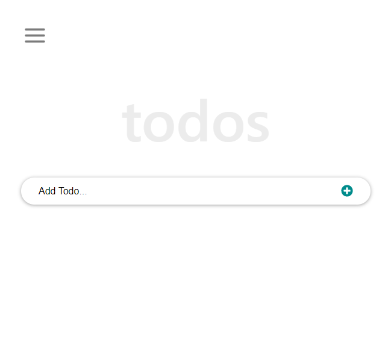

# Todo Project

> A simple ReactJS Todo project

## [Live Link](https://mrbrn197.github.io/React-Todo-Project)

## Built With

- ReactJS
- CSS
- Eslint, Stylelint

## Getting Started

To get a local copy up and running clone the repo and run

`npm install`

### Install

to build a the project into `./build` folder run

`npm run build`

### Usage

to serve the application on `localhost` run

`npm start`

## Authors

👤 **Brian Orora**

- GitHub: [@MrBrN197](https://github.com/githubhandle)
- LinkedIn: [brianorora](https://www.linkedin.com/in/brian-orora-2b7883a7/)
- Twitter [@MrBrN197](https://twitter.com/MrBrN197)

## 🤝 Contributing

Contributions, issues, and feature requests are welcome!

Feel free to check the [issues page](../../issues/).

## Show your support

Give a ⭐️ if you like this project!
